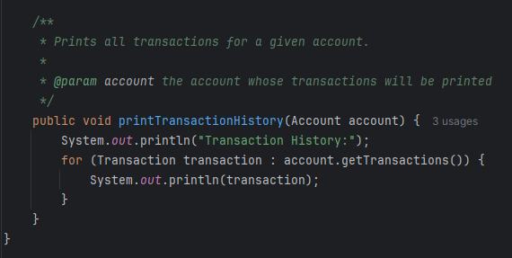
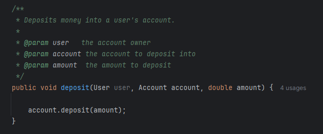
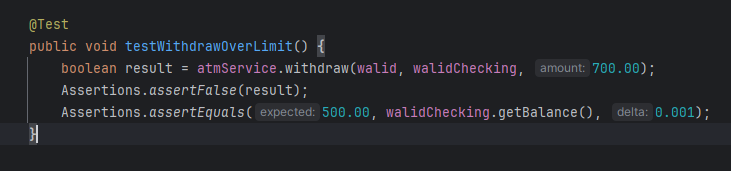
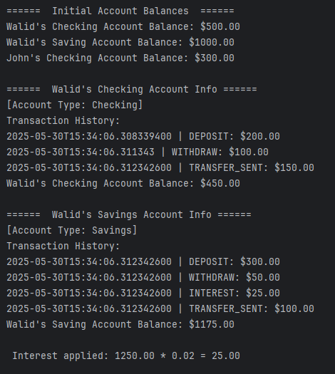
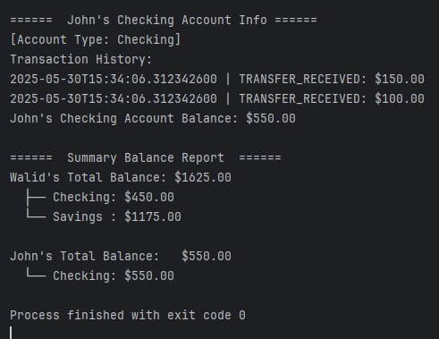
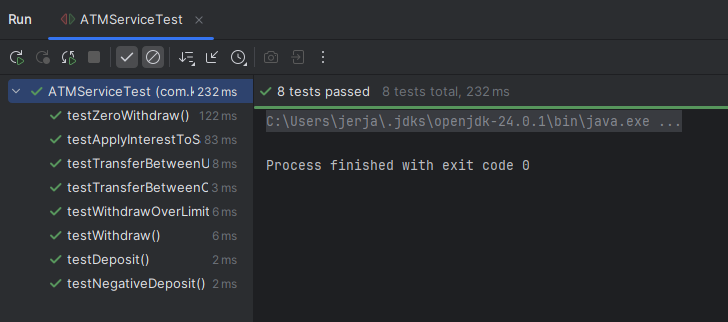

# ATM System Java CLI Application

## Documentation

This is a **Command-Line Interface (CLI)** based **ATM system** built with **Java**, **JUnit 5**, and **Maven**. The application simulates core banking operations such as:

- Deposits and Withdrawals
- Checking and Savings Accounts
- Transfers (within user and between users)
- Interest calculation for savings accounts
- Transaction history with timestamps

It’s designed with an **Object-Oriented Programming (OOP)** approach and adheres to **clean code** and **test-driven development (TDD)** principles.

---

## How It Works

The application is structured with modular classes:

### `User`
Represents a bank customer, holding one or more accounts. Each user is created with a name and PIN.

### `Account` (Abstract)
A generic base class for all account types. It handles common logic such as deposits, withdrawals, and transaction tracking.

### `CheckingAccount`
Inherits from `Account`. Allows overdraft up to a specified limit.

### `SavingAccount`
Inherits from `Account`. Does **not allow overdraft** and supports **interest accumulation** via `applyInterest()`.

### `Transaction`
Records the transaction type (e.g., `DEPOSIT`, `WITHDRAW`, `INTEREST`, `TRANSFER_SENT`), the amount, and the time it occurred.

### `ATMService`
Contains the business logic for performing banking operations like deposit, withdraw, and transfer. Also handles printing account balances and transaction history.

---

## Unit Testing

The project includes over 3 unit tests written using **JUnit 5**, testing both valid and invalid scenarios:

### Detailed Test Scenarios

**`testDeposit()`**  
Validates deposit correctly updates account balance 

**`testNegativeDeposit()`**  
Ensures negative deposits are rejected 

**`testWithdraw()`**  
Verifies withdrawal decreases balance appropriately 

**`testWithdrawOverLimit()`**  
Ensures overdrafts beyond the limit are denied 

**`testZeroWithdraw()`**  
Rejects zero-value withdrawal attempts 

**`testTransferBetweenOwnAccounts()`**  
Validates internal transfer between a user's own accounts 

**`testTransferBetweenUsers()`**  
Ensures successful money transfer between two different users 

**`testApplyInterestToSavings()`**  
Checks correct interest computation and application 

### Example Test

```java
@Test
public void testWithdraw() {
    boolean result = atmService.withdraw(alice, aliceChecking, 100.00);
    assertTrue(result);
    assertEquals(400.00, aliceChecking.getBalance(), 0.001);
}

```

All tests run automatically via GitHub Actions.

---

## Clean Code Practices (Based on Clean Code by Robert C. Martin)

This project follows strong clean code principles from Clean Code: A Handbook of Agile Software Craftsmanship, illustrated below with real code examples:

### 1. Meaningful Naming ( Chapter 2 – Meaningful Names)
Variables and methods are named to reveal intent.
Examples: **`getAccountByType()`**, **`applyInterest()`**, **`printTransactionHistory()`**

```java
public Account getAccountByType(String type) {
    // Clear and expressive
}
```

### 2. Small Functions (Chapter 3 – Functions)
Each method is focused, doing one thing well.
Examples: **`printAccountInfo()`**, **`deposit()`**, **`withdraw()`**, and **`applyInterest()`**.

```java
    public void printAccountInfo(User user, Account account) {
        System.out.printf("%s's %s Account Balance: $%.2f%n",
                user.getName(), account.getAccountType(), account.getBalance());
    }
```

### 3. JavaDoc and Comments Only Where Needed (Chapter 4 – Comments)
JavaDoc is used at method/class level for clarity, avoiding unnecessary inline comments.

```java
 /**
 * Deposits money into a user's account.
 *
 * @param user   the account owner
 * @param account the account to deposit into
 * @param amount  the amount to deposit
 */
public void deposit(User user, Account account, double amount) {

    account.deposit(amount);
}
```
### 4. Abstraction (Chapter 6 – Objects and Data Structures)

**`Account`** defines an abstract class.
**`CheckingAccount`** and **`SavingAccount`** provide specific behavior implementations.

```java
/**
 * Abstract class representing a generic bank account.
 * Tracks balance and transaction history.
 */
public abstract class Account {
    protected double balance;
    protected List<Transaction> transactions;
}
```


### 5. Encapsulation (Chapter 10 – Classes)
Fields are private (e.g., name, pin), and accessed via methods (e.g. getName())
```java
public class User {
    private final String name;
    private final int pin;
    private final List<Account> accounts;
}
```

### 6. Clean Tests ( Chapter 9 – Unit Tests)
Tests are simple, isolated, and clearly named.
**`testWithdrawOverLimit()`** tests overdraft rejection logic cleanly.

```java
    @Test
    public void testWithdrawOverLimit() {
        boolean result = atmService.withdraw(walid, walidChecking, 700.00);
        Assertions.assertFalse(result);
        Assertions.assertEquals(500.00, walidChecking.getBalance(), 0.001);
    }
```
### 7. Avoid Duplication ( Chapter 9 – Unit Tests)
Common logic like transaction  logging is reused via **`addTransaction()`**.
```java

    public void applyInterest() {
        double interest = balance * INTEREST_RATE;
        balance += interest;
        addTransaction(TransactionType.INTEREST, interest);
    }
```

## Screenshot Examples

## Below are some screenshots that demonstrate the clean code structure:
### Meaningful Naming Example


### JavaDoc Example


### Clean Test Example


## Below are Screenshots for the output



## Screenshot for the passed unit tests are below




---

## Dependencies

All dependencies are managed via Maven. Key libraries include:

```xml
<dependency>
    <groupId>org.junit.jupiter</groupId>
    <artifactId>junit-jupiter</artifactId>
    <version>5.9.3</version>
</dependency>
```

All dependencies were retrieved from [Maven Central](https://search.maven.org/).

---

## GitHub Actions (CI/CD)

- A GitHub Actions workflow is configured in `.github/workflows/maven.yml`
- Automatically builds and runs tests on every **Pull Request**
- Uses Java 24 and `mvn test`

---

##  Dev/Trunk-Based Workflow

To ensure maintainability and collaboration:

- All work was done using short-lived feature branches (e.g., `failing-test-demo`)
- Code was never pushed directly to `master`
- Pull Requests were opened for all changes and reviewed
- GitHub Actions validated code on every PR
---

## Problems Encountered
### Transition from VS Code to IntelliJ IDEA

One of the main challenges faced during this QAP was migrating the project environment from **Visual Studio Code (VS Code)** to **IntelliJ IDEA**.
While VS Code was initially used, the transition was necessary to take advantage of IntelliJ’s advanced features.
Thanks to the clear in-class instructions and documentation, the migration process was manageable.

---

## Project Structure

```
ATM-System/
├── src/
│   ├── main/java/com/keyin/       # Application code
│   └── test/java/com/keyin/       # JUnit 
├── .github/workflows/maven.yml    # GitHub Actions CI
├── README.md                      # Documentation
├── Screenshots                    # Sreenshots Images
└── pom.xml                        # Maven configuration


```

---

This project was developed as part of the **SDAT and DevOps QAP 1** course. It demonstrates:
* Object-Oriented Design
* Test-Driven Development
* Clean Coding Practices
* Continuous Integration with Maven & GitHub Actions


